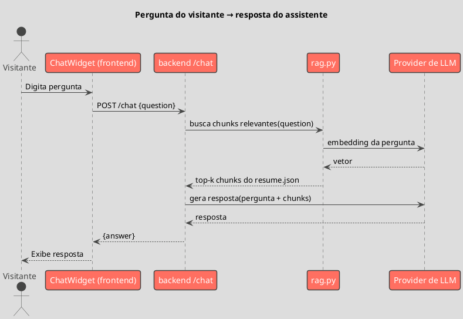

# C4 PlantUML — Padrões de Referência (Currículo Online)

## Regras de ouro (sempre seguir)

1. **Tema obrigatório**: `!theme toy` em todo diagrama
2. **Include condicional**: só incluir `C4_*.puml` quando usar macros C4 (Boundary, Component, Container, Deployment). Sequence diagrams **não** incluem C4
3. **Sem `LAYOUT_WITH_LEGEND()`**: não usar
4. **Título sempre presente**: `title` em todo diagrama
5. **Protocolo nas Rel**: sempre explícito — `"HTTPS"`, `"REST"`
6. **Externos fora do Boundary**: provedor de LLM/embeddings fica fora do `Boundary` do site
7. **Stack**: rótulos de tecnologia = **Next.js/TypeScript** (frontend) e **Python/FastAPI** (backend)

---

## Context Diagram — Nível 1 (C4_Context)

```plantuml
@startuml
!theme toy
!include https://raw.githubusercontent.com/plantuml-stdlib/C4-PlantUML/master/C4_Context.puml

title Currículo Online – Contexto (Nível 1)

Person(visitante, "Visitante", "Recrutador ou interessado navegando o currículo")

System(site, "Currículo Online", "Site pessoal com assistente de chat sobre a trajetória")

System_Ext(llm, "Provider de LLM/Embeddings", "API externa (ex.: OpenAI) para gerar embeddings e respostas")

Rel(visitante, site, "Navega e conversa com o assistente", "HTTPS")
Rel(site, llm, "Gera embeddings e respostas", "HTTPS")
@enduml
```

---

## Container Diagram — Nível 2 (C4_Container)

```plantuml
@startuml
!theme toy
!include https://raw.githubusercontent.com/plantuml-stdlib/C4-PlantUML/master/C4_Container.puml

title Currículo Online – Containers (Nível 2)

Person(visitante, "Visitante")

System_Boundary(site, "Currículo Online") {
    Container(frontend, "frontend", "Next.js / TypeScript / Tailwind", "Site do currículo + ChatWidget, hospedado na Vercel")
    Container(backend, "backend", "Python / FastAPI", "Endpoint /chat: RAG sobre o resume.json, hospedado no Render/Cloud Run")
    ContainerDb(resume, "resume.json", "JSON", "Fonte de verdade do conteúdo do currículo")
}

System_Ext(llm, "Provider de LLM/Embeddings", "API externa")

Rel(visitante, frontend, "Acessa", "HTTPS")
Rel(frontend, resume, "Lê conteúdo estático", "import")
Rel(frontend, backend, "POST /chat", "REST (HTTPS)")
Rel(backend, resume, "Chunking do conteúdo", "leitura de arquivo")
Rel(backend, llm, "Embeddings + geração", "HTTPS")
@enduml
```

---

## Component Diagram — Nível 3 (C4_Component)

Use para: internos do backend de RAG.

```plantuml
@startuml
!theme toy
!include https://raw.githubusercontent.com/plantuml-stdlib/C4-PlantUML/master/C4_Component.puml

title backend – Componentes (Nível 3)

Boundary(backend, "backend (Python / FastAPI)") {
    Component(main, "main.py", "FastAPI app", "Rotas, CORS, inicialização")
    Component(chat, "chat.py", "FastAPI router", "Endpoint /chat: orquestra pergunta → contexto → resposta")
    Component(rag, "rag.py", "Módulo Python", "Chunking, embeddings, busca por similaridade")
}

ContainerDb(resume, "resume.json", "JSON")
System_Ext(llm, "Provider de LLM/Embeddings")

Rel(main, chat, "registra rota")
Rel(chat, rag, "busca chunks relevantes")
Rel(rag, resume, "lê e faz chunking")
Rel(rag, llm, "gera embeddings")
Rel(chat, llm, "gera resposta com contexto")
@enduml
```

---

## Sequence Diagram — Fluxo do chat



---

## Deployment Diagram — Nível 4 (C4_Deployment)

```plantuml
@startuml
!theme toy
!include https://raw.githubusercontent.com/plantuml-stdlib/C4-PlantUML/master/C4_Deployment.puml

title Implantação – Currículo Online (Nível 4)

Deployment_Node(vercel, "Vercel", "Edge/Serverless") {
    Container(frontend, "frontend", "Next.js")
}

Deployment_Node(render, "Render / Cloud Run", "Container") {
    Container(backend, "backend", "FastAPI")
}

Deployment_Node(ext, "Provider externo", "") {
    Container(llm, "LLM/Embeddings API", "HTTPS")
}

Rel(frontend, backend, "REST (HTTPS)")
Rel(backend, llm, "HTTPS")
@enduml
```

---

## Convenções de nomenclatura

| Elemento | Convenção |
|---|---|
| Alias | nome real do container/pasta: `frontend`, `backend`, `rag`, `chat` |
| Pessoas | papel funcional (`Visitante`) |
| Externos | fora do `Boundary` do site |
| Protocolo nas Rel | sempre explícito no terceiro parâmetro |
| Tecnologia dos containers | `Next.js/TypeScript` (frontend) / `Python/FastAPI` (backend) |

## Mapa de diagramas por audiência

| Diagrama | Audiência | Detalhe |
|---|---|---|
| Context (L1) | Quem só quer entender o produto | Site + provider de LLM |
| Container (L2) | Você mesmo revisando a arquitetura | frontend / backend / resume.json |
| Component (L3) | Ao implementar o RAG | Internos do backend |
| Sequence | Ao debugar o fluxo de chat | Pergunta → contexto → resposta |
| Deployment (L4) | Ao configurar hospedagem | Vercel + Render/Cloud Run |
