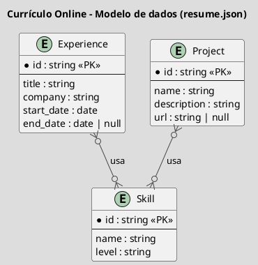

# Modelagem de Dados (ER) — Padrões de Referência (Currículo Online)

Arquivo de saída: `docs/architecture/DATA-NNN-titulo.md` (`NNN` sequencial, 3 dígitos, própria sequência — ver `docs/agents/CONTEXTO-PROJETO.md`).

## Quando gerar

Item de DoR (`@product-owner`) para toda história que introduz ou altera **entidades com relação entre si** — não para um campo novo isolado em `resume.json`. Exemplos:

- Faz sentido: `resume.json` ganha `experiences[].skills[]` referenciando `skills[].id` (relação 1-N)
- Não faz sentido: adicionar campo `github_url` em `contact` — documentar só no schema da história (DoR), sem diagrama

## Regras de ouro

1. **Tema obrigatório**: `!theme toy` em todo diagrama
2. **Título sempre presente**: `title` em todo diagrama
3. **Cardinalidade explícita**: `||--o{`, `}o--||` etc. — nunca deixar implícita
4. **Fonte real**: nomes de entidade/campo iguais aos do schema (`resume.json` ou modelo Pydantic), não abstrações genéricas
5. **Sem banco vetorial/relacional de verdade**: este projeto usa `resume.json` como fonte da verdade — o ER aqui documenta a estrutura lógica dos dados, não implica introduzir um banco (ver anti-padrões do `SKILL.md`)
6. **Toda fonte PlantUML entregue vira imagem** — mesma regra do `references/c4-patterns.md`

---

## Entity-Relationship Diagram



---

## Renderização em imagem (obrigatório)

Mesmo processo do `references/c4-patterns.md` — via [Kroki](https://kroki.io), sem instalação local:

```bash
curl -sS -X POST -H "Content-Type: text/plain" \
  --data-binary @diagrama.puml \
  https://kroki.io/plantuml/svg \
  -o docs/architecture/images/DATA-NNN-er.svg
```

**Padrão de embed no `.md`** — imagem primeiro, fonte depois:

````markdown
## Modelo de dados

```plantuml
@startuml
...
@enduml
```



````

## Convenções de nomenclatura

| Elemento | Convenção |
|---|---|
| Nome de entidade | igual ao schema real (`Experience`, não `ExperienceEntity`) |
| Campo | igual ao campo do JSON/Pydantic (`start_date`, não `startDate` no ER se o schema usa snake_case) |
| PK | `<<PK>>` explícito |
| Relação opcional | `o{` do lado que pode ser zero |

