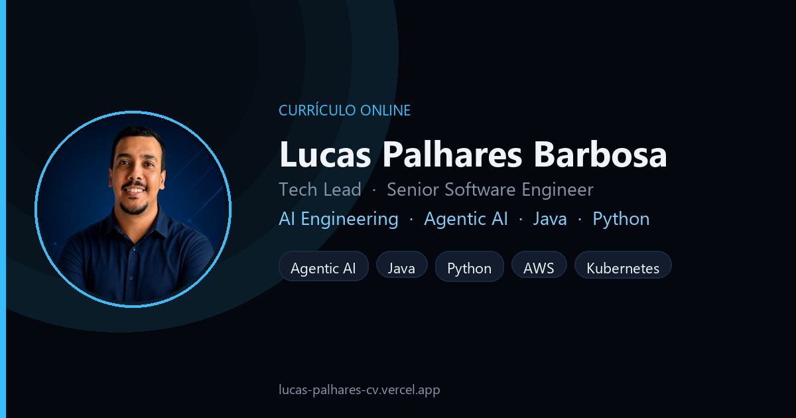
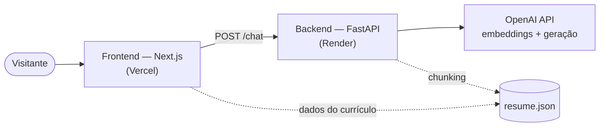
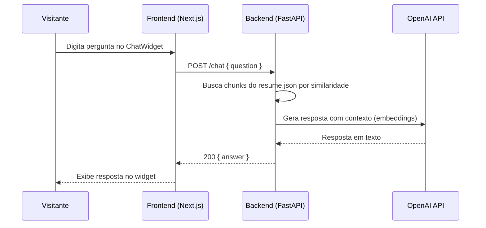
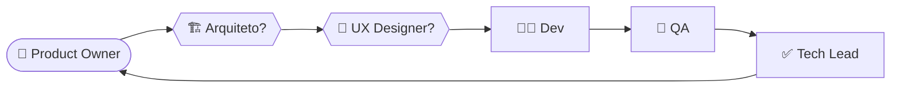

<div align="center">



<br/><br/>

# Currículo Online

**Meu currículo em forma de produto: site com um assistente de IA (RAG) que responde perguntas sobre a minha trajetória — e, por baixo, um estudo de caso de engenharia com agentes.**

[](https://lucas-palhares-cv.vercel.app)
[](https://github.com/lucaspalharesbarbosa/curriculo-online-ia/actions/workflows/frontend-ci.yml)
[](https://github.com/lucaspalharesbarbosa/curriculo-online-ia/actions/workflows/backend-ci.yml)
[](LICENSE)

**[🌐 Acessar o site](https://lucas-palhares-cv.vercel.app)** &nbsp;·&nbsp; **[🤖 Como foi construído com IA](#como-agentes)** &nbsp;·&nbsp; **[💼 LinkedIn](https://www.linkedin.com/in/lucas-palhares-barbosa/)**

</div>

<br/>

## 📑 Sumário

- [Sobre](#sobre)
- [Funcionalidades](#funcionalidades)
- [Arquitetura](#arquitetura)
- [Stack](#stack)
- [Qualidade & CI](#qualidade)
- [Rodando localmente](#rodando-localmente)
- [Variáveis de ambiente](#env)
- [Como foi construído com agentes de IA](#como-agentes)
- [Roadmap](#roadmap)
- [Documentação](#documentacao)
- [Licença](#licenca)
- [Contato](#contato)

<br/>

<a id="sobre"></a>

## ✨ Sobre

Currículo com todas as seções de um perfil profissional — experiência, formação, skills, certificações, reconhecimentos — mais um **chat com IA** que responde perguntas específicas sobre a minha trajetória com base nesse conteúdo, sem exigir que o visitante leia tudo manualmente.

O repositório é, ao mesmo tempo, o produto e o método por trás dele:

| | O quê |
|---|---|
| **Produto** | Currículo online + assistente que responde com RAG sobre `frontend/content/resume.json` |
| **Método** | Histórias INVEST, DoR/DoD, ADRs, CI por serviço, PRs mesmo trabalhando sozinho |

<br/>

<a id="funcionalidades"></a>

## 🚀 Funcionalidades

**🧑‍💼 Currículo completo** — hero, experiência profissional em linha do tempo, formação, skills categorizadas, certificações e reconhecimentos, tudo a partir de um único `resume.json` versionado.

**💬 Assistente de IA (RAG)** — endpoint `/chat` no FastAPI: os dados do currículo são divididos em chunks, transformados em embeddings e comparados por similaridade a cada pergunta; a resposta é gerada com esse contexto. Perguntas fora do escopo do currículo não geram erro — o assistente responde com um fallback textual.

**📱 Mobile-first** — layout responsivo, auditado em mobile/tablet/desktop.

**♿ Acessível** — contraste adequado, `alt` em todas as imagens, navegação completa por teclado.

**🔍 SEO & Open Graph** — meta tags e imagem de preview configuradas para compartilhamento (é a mesma imagem usada no topo deste README).

**🔒 Seguro** — CORS restrito à origem do site, rate limit no `/chat`, nenhum segredo commitado (chaves só nas plataformas de hospedagem).

<br/>

<a id="arquitetura"></a>

## 🏗️ Arquitetura

Monorepo com dois serviços independentes, cada um com seu próprio CI:



Fluxo de uma pergunta no chat, do clique até a resposta:



`frontend/` (Next.js, deploy na Vercel) e `backend/` (FastAPI, deploy no Render) vivem no mesmo repositório, mas têm pipelines de CI, dependências e deploys independentes.

<br/>

<a id="stack"></a>

## 🛠️ Stack

<div align="center">


</div>

| Camada | Tecnologias |
|---|---|
| **Frontend** | Next.js (App Router) · React · TypeScript · Tailwind CSS · Zod (`content/resume.schema.ts`) |
| **Backend** | Python · FastAPI · Pydantic · OpenAI API (embeddings + geração) |
| **Qualidade** | Vitest + Testing Library · pytest · ESLint/Prettier · ruff/black · Husky + lint-staged |
| **Deploy** | Vercel (frontend) · Render (backend) · CI no GitHub Actions |

<br/>

<a id="qualidade"></a>

## 🧪 Qualidade & CI

Cada serviço tem workflow de CI próprio, disparado em todo PR:

| Workflow | Cobre |
|---|---|
| `frontend-ci.yml` | `npm run lint` · `npm run format` · `npm test` (Vitest) · `npm run validate:resume` (schema Zod) · build |
| `backend-ci.yml` | `ruff check` · `black --check` · `pytest` |

Branches `main` e `develop` são protegidas: PR + CI obrigatórios, sem push direto nem force-push. O Husky roda `lint-staged` (Prettier + ESLint) no `pre-commit` do frontend, pegando o mesmo tipo de problema que o CI pegaria — antes de abrir o PR.

<br/>

<a id="rodando-localmente"></a>

## 📦 Rodando localmente

**Pré-requisitos:** Node.js 22+ · Python 3 · uma `LLM_API_KEY` da OpenAI (para o chat)

```bash
git clone https://github.com/lucaspalharesbarbosa/curriculo-online-ia.git
cd curriculo-online-ia

# Frontend
cd frontend
npm install
npm run dev              # http://localhost:3000

# Backend (em outro terminal)
cd backend
pip install -r requirements.txt
# Edite backend/.env → LLM_API_KEY=<sua chave da OpenAI>
uvicorn app.main:app --reload   # http://127.0.0.1:8000
```

Outros comandos úteis:

```bash
npm run lint / format / test     # frontend
ruff check . && black --check .  # backend — lint
pytest                           # backend — testes
```

Documentação completa por serviço: [`frontend/README.md`](frontend/README.md) · [`backend/README.md`](backend/README.md).

<br/>

<a id="env"></a>

## 🔐 Variáveis de ambiente

Nenhum valor real é commitado no repositório — cada serviço tem seu `.env.example` (sem valores reais) e as chaves de fato ficam configuradas no painel da respectiva plataforma de hospedagem.

| Variável | Serviço | Onde configurar | Segredo? |
|---|---|---|---|
| `LLM_API_KEY` | Backend | **Dev:** `backend/.env`. **Produção / fonte do valor:** [Render](https://dashboard.render.com) → Web Service **`curriculo-online-backend`** → **Environment** → variável **`LLM_API_KEY`** (revelar/copiar no painel e colar no `.env` local se for o caso) | Sim — chave da OpenAI (embeddings + geração, [ADR-003](docs/architecture/ADR-003-fluxo-rag.md) seção 5) |
| `ALLOWED_ORIGIN` | Backend | `backend/.env` local (dev) / Render → `curriculo-online-backend` → Environment (produção) | Não — só a origem permitida no CORS do `/chat` |
| `NEXT_PUBLIC_API_URL` | Frontend | `frontend/.env.local` local (dev) / painel da **Vercel** → Project Settings → Environment Variables (produção) | Não — URL pública do backend, embutida no bundle do client |
| `NEXT_PUBLIC_SITE_URL` | Frontend | `frontend/.env.local` local (dev) / painel da **Vercel** → Project Settings → Environment Variables (produção) | Não — URL pública do site, usada em metadata/Open Graph |
| `ENVIRONMENT` | Backend | `backend/.env` local (dev) / Render → `curriculo-online-backend` → Environment (produção) | Não — rótulo de ambiente (`development`/`production`); em `production` desativa `/docs`, `/redoc` e `/openapi.json` — detalhes em [`backend/README.md`](backend/README.md#documentacao-da-api) |

Setup local: o backend cria `backend/.env` a partir de `.env.example` na primeira subida. Preencha `LLM_API_KEY` com o valor da secret no Render (caminho acima) ou com uma chave nova da [OpenAI Platform](https://platform.openai.com/api-keys). Detalhes: [`backend/README.md`](backend/README.md#setup-local-obrigatório-para-o-chat).

<br/>

<a id="como-agentes"></a>

## 🤖 Como este projeto foi construído com agentes de IA

Este repositório é ao mesmo tempo o **produto** e um **estudo de caso** de engenharia com agentes: um pipeline enxuto, proporcional a um projeto solo, com papéis claros e artefatos auditáveis — sem virar processo de squad grande. Orquestrado por `@orquestrador` (skill em `.claude/skills/orquestrador/`):



| Papel | Skill | Entrega típica |
|---|---|---|
| Product Owner | `@product-owner` | PRD, histórias com DoR/DoD, aceite |
| Arquiteto | `@arquiteto-ia-senior` | ADR / C4 quando há decisão de stack |
| UX Designer | `@ux-designer` | Protótipo visual, só sob pedido |
| Dev | `@senior-developer` | Código + testes do escopo |
| QA | `@qa-engineer` | Relatório e veredito na história |
| Tech Lead | `@tech-lead-review` | Review e veredito de merge |

Cada história de backlog carrega uma tabela **Vereditos** (QA, Tech Lead, PO) — o aceite não fica só no chat. Contexto obrigatório dos agentes: [`docs/agents/CONTEXTO-PROJETO.md`](docs/agents/CONTEXTO-PROJETO.md) · índice: [`docs/agents/README.md`](docs/agents/README.md).

<br/>

<a id="roadmap"></a>

## 🗺️ Roadmap

Status de execução por fase, do início do projeto até a evolução pós-lançamento:

| Fase | Descrição | Status |
|---|---|---|
| 0 | Preparação: agentes + repositório | ✅ Done |
| 1 | Descoberta e planejamento | ✅ Done |
| 2 | Setup do projeto | ✅ Done |
| 3 | MVP estático | ✅ Done (17/17) |
| 4 | Polimento (SEO, acessibilidade) | ✅ Done (2/2) |
| 5 | Feature de IA (RAG) | ✅ Done (9/9) |
| 6 | Divulgação | ✅ Done |
| 7 | Frontend & UX v2 | 🚧 Em andamento |

Detalhes de cada fase, com links para as histórias: [`docs/product/roadmap.md`](docs/product/roadmap.md).

<br/>

<a id="documentacao"></a>

## 📖 Documentação

**Planejamento**
- Roadmap e status por fase: [`docs/product/roadmap.md`](docs/product/roadmap.md)
- PRDs (épicos): [PRD-001 Conteúdo](docs/product/PRD-001-conteudo.md) · [PRD-003 RAG](docs/product/PRD-003-rag.md) · [PRD-004 Deploy](docs/product/PRD-004-deploy.md) · [índice completo](docs/product/)
- Backlog por fase: [`docs/product/backlog/`](docs/product/backlog/)

**Arquitetura**
- [ADR-001 — Stack inicial (monorepo Next.js + FastAPI)](docs/architecture/ADR-001-stack-inicial-monorepo.md)
- [ADR-002 — Hospedagem gratuita (Vercel + Render)](docs/architecture/ADR-002-hospedagem-gratuita.md)
- [ADR-003 — Fluxo de RAG](docs/architecture/ADR-003-fluxo-rag.md)
- Índice completo (incl. ADR-004 a ADR-007): [`docs/architecture/`](docs/architecture/)

<br/>

<a id="licenca"></a>

## 📄 Licença

Distribuído sob a licença [MIT](LICENSE).

<br/>

<a id="contato"></a>

<div align="center">

---

### Lucas Palhares Barbosa
Tech Lead · Senior Software Engineer · AI Engineering

[LinkedIn](https://www.linkedin.com/in/lucas-palhares-barbosa/) · [GitHub](https://github.com/lucaspalharesbarbosa) · [Site](https://lucas-palhares-cv.vercel.app) · [E-mail](mailto:lucasp.b@hotmail.com)

</div>
