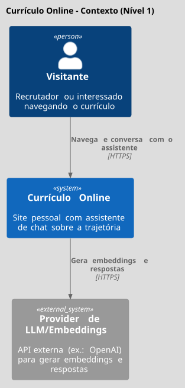
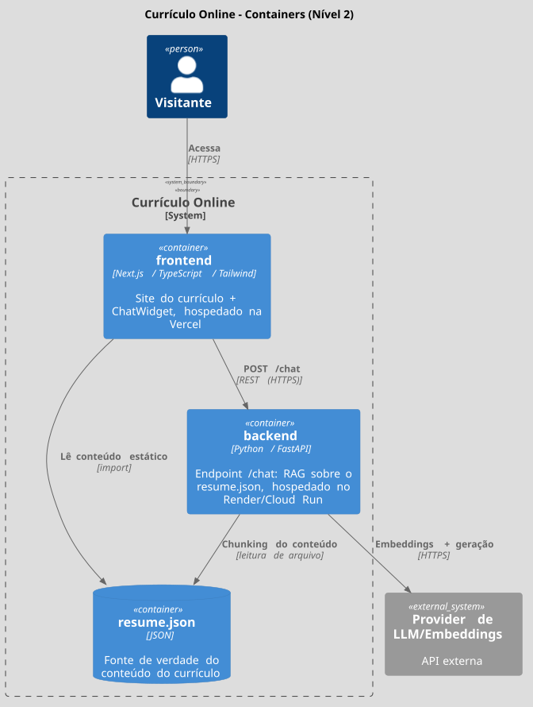

# C4-001 — Contexto e Containers

Referência de arquitetura para os épicos Frontend, RAG e Deploy (`docs/product/`). Decisão de stack formalizada em [ADR-001](ADR-001-stack-inicial-monorepo.md).

## Contexto (Nível 1)



```plantuml
@startuml
!theme toy
!include https://raw.githubusercontent.com/plantuml-stdlib/C4-PlantUML/master/C4_Context.puml

title Currículo Online – Contexto (Nível 1)

Person(visitante, "Visitante", "Recrutador ou interessado navegando o currículo")

System(site, "Currículo Online", "Site pessoal com assistente de chat sobre a trajetória")

System_Ext(llm, "Provider de LLM/Embeddings", "API externa (ex.: OpenAI) para gerar embeddings e respostas")

Rel(visitante, site, "Navega e conversa com o assistente", "HTTPS")
Rel(site, llm, "Gera embeddings e respostas", "HTTPS")
@enduml
```

## Containers (Nível 2)



```plantuml
@startuml
!theme toy
!include https://raw.githubusercontent.com/plantuml-stdlib/C4-PlantUML/master/C4_Container.puml

title Currículo Online – Containers (Nível 2)

Person(visitante, "Visitante")

System_Boundary(site, "Currículo Online") {
    Container(frontend, "frontend", "Next.js / TypeScript / Tailwind", "Site do currículo + ChatWidget, hospedado na Vercel")
    Container(backend, "backend", "Python / FastAPI", "Endpoint /chat: RAG sobre o resume.json, hospedado no Render/Cloud Run")
    ContainerDb(resume, "resume.json", "JSON", "Fonte de verdade do conteúdo do currículo")
}

System_Ext(llm, "Provider de LLM/Embeddings", "API externa")

Rel(visitante, frontend, "Acessa", "HTTPS")
Rel(frontend, resume, "Lê conteúdo estático", "import")
Rel(frontend, backend, "POST /chat", "REST (HTTPS)")
Rel(backend, resume, "Chunking do conteúdo", "leitura de arquivo")
Rel(backend, llm, "Embeddings + geração", "HTTPS")
@enduml
```

## Próximos níveis

Component (L3), Sequence e Deployment (L4) ficam para quando a Fase 5 (RAG) entrar em execução ([US-05-01](../product/backlog/fase-05/US-05-01-adr-fluxo-rag.md) em diante) — ver modelos prontos em `.claude/skills/arquiteto-ia-senior/references/c4-patterns.md`. Não antecipar detalhe de componente antes do ADR do fluxo de RAG (US-05-01) existir.

## Referências
- [ADR-001 — Stack inicial e monorepo](ADR-001-stack-inicial-monorepo.md)
- `docs/agents/CONTEXTO-PROJETO.md`
- `docs/product/PRD-003-rag.md`
