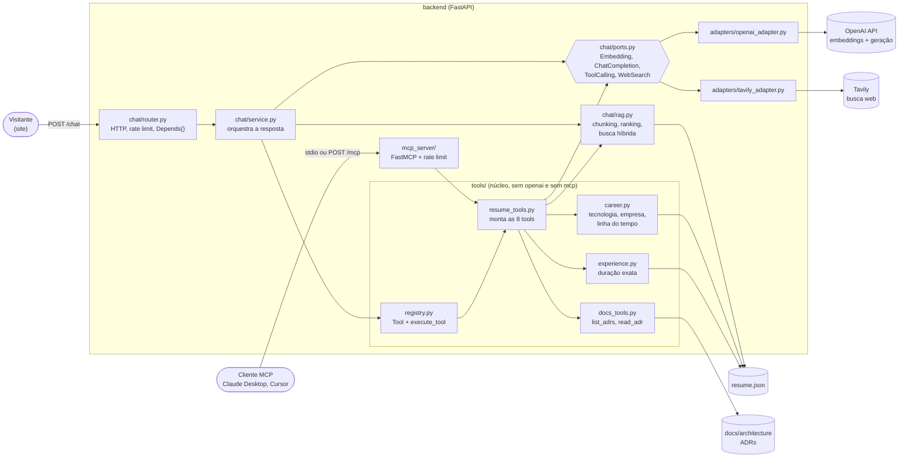
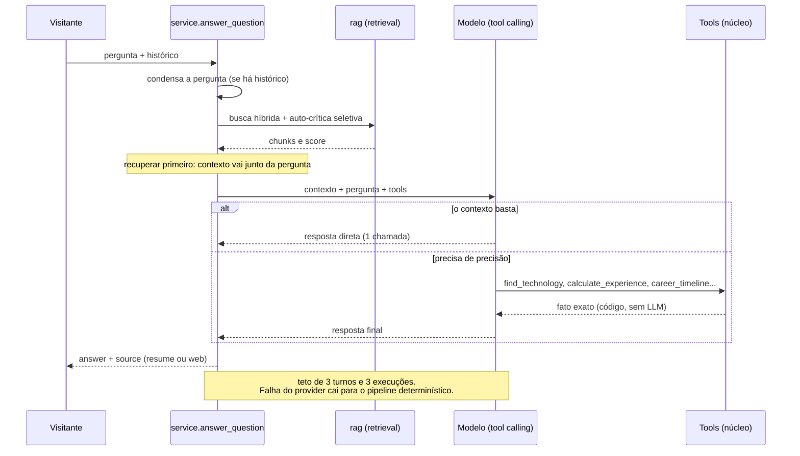

# C4-002: Componentes do backend (chat, tools e MCP)

Detalha o container `backend` do [C4-001](C4-001-contexto-containers.md) (Nível 3). Decisões: [ADR-012](ADR-012-clean-architecture-chat.md) (Ports & Adapters), [ADR-017](ADR-017-tools-e-mcp-um-nucleo-duas-portas.md) (um núcleo, duas portas) e [ADR-018](ADR-018-tools-estruturadas-recuperar-primeiro-hibrida.md) (tools estruturadas, recuperar primeiro, busca híbrida).

## Componentes

O núcleo `tools/` não conhece protocolo: o `chat/service.py` traduz `Tool` para o function calling da OpenAI e o `mcp_server/` traduz o mesmo registro para MCP. Um teste garante que os dois schemas não divergem.

## Fluxo de uma pergunta com tool calling (flag `CHAT_TOOL_CALLING`)

## Referências
- [C4-001: Contexto e Containers](C4-001-contexto-containers.md)
- [ADR-017](ADR-017-tools-e-mcp-um-nucleo-duas-portas.md), [ADR-018](ADR-018-tools-estruturadas-recuperar-primeiro-hibrida.md)
