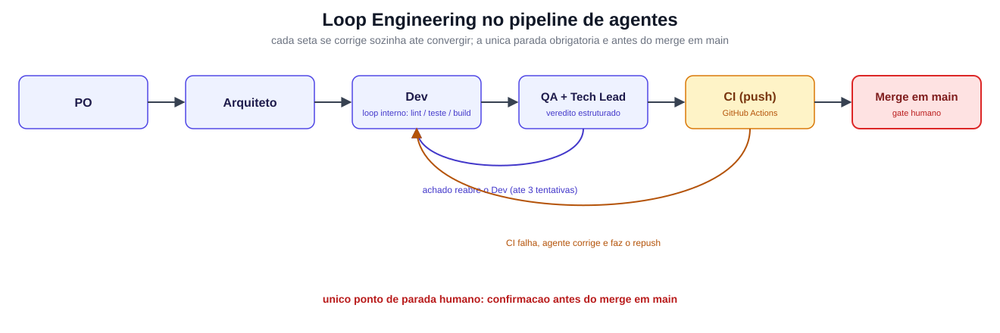

# Loop Engineering: como fiz meus agentes de IA corrigirem os próprios erros até o merge

> Artigo 1 da série. Lastro: `docs/architecture/ADR-015-loop-engineering-pipeline.md`. Publicar como artigo LinkedIn (long-form), com o diagrama abaixo inserido no corpo. Link do projeto no primeiro comentário.

---

Venho construindo meu portfólio pessoal (site de currículo com assistente de chat) usando um pipeline de agentes de IA: um Product Owner, um arquiteto, um dev, um QA, um tech lead. Eu fico no topo, como dono técnico do produto.

O aprendizado que mais mudou a velocidade do projeto foi simples de resumir: parei de tratar cada etapa do pipeline como uma parada obrigatória e passei a tratá-la como um loop.

## O problema

No começo, quando o QA reprovava ou o tech lead pedia mudança, o protocolo mandava parar tudo e esperar eu decidir o próximo passo. Parecia prudente. Na prática era desperdício: a maioria das reprovações era um teste quebrado, um erro de lint, uma cobertura abaixo do piso combinado. Problema com sinal de verificação claro (o próprio `pytest`, o próprio `eslint` já diziam o que estava errado), mas o pipeline parava do mesmo jeito, esperando eu autorizar o óbvio.

## A virada

Se uma etapa produz um sinal de feedback verificável (teste, lint, cobertura, veredito estruturado de review), ela não precisa da minha aprovação para se corrigir. Precisa só corrigir, testar de novo, e seguir.

Formalizei em três níveis, mostrados no diagrama:

1. **Loop interno**: lint, teste, build, dentro do próprio dev
2. **Loop entre fases**: achado do QA ou do tech lead reabre o dev automaticamente
3. **Loop de CI**: falha no GitHub Actions, o agente lê o log, corrige e faz o repush sozinho

## O único ponto onde fico no controle

Existe um único gate humano: o merge de `develop` para `main`. É onde o deploy de produção acontece de verdade, a ação mais difícil de desfazer. Só ali o orquestrador para e espera minha confirmação.

Tudo antes disso roda sozinho, com um limite: no máximo três tentativas por loop. Na terceira falha sem convergir, escala para mim com o histórico completo. Falha repetida com a mesma assinatura escala na hora, sem gastar tentativa. Código sensível (chave de API, CORS, segredo) nunca entra em loop automático.

## O que mudou de verdade

O ganho não é só velocidade. É onde a minha atenção é gasta. Antes eu era interrompido tanto para decisões que exigiam julgamento real quanto para um lint quebrado, que tem resposta certa, não opinião. Hoje só sou chamado para decisão de verdade e para o merge em produção.

No próximo artigo conto o que esse pipeline construiu: a estratégia de RAG do projeto, incluindo a memória conversacional que faltava para o assistente entender "onde fica a matriz da empresa?" depois de "onde você trabalha?".

#AIEngineering #EngenhariaDeIA #LLM #DesenvolvimentoDeSoftware
