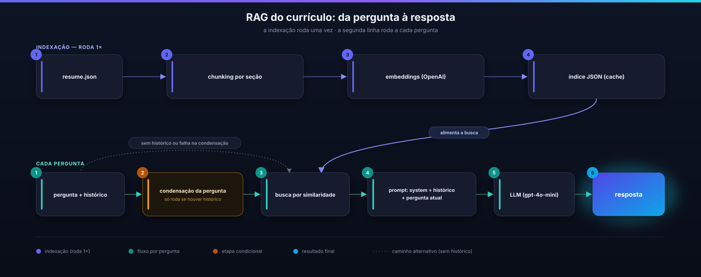

# RAG na prática: memória conversacional, chunking e embeddings sem exagero de engenharia

> Artigo 2 da série. Lastro: `docs/architecture/ADR-003-fluxo-rag.md`, `ADR-014-memoria-conversacional-chat.md`, `PRD-013-memoria-conversacional-rag.md`, US-15-01/02/03. Publicar como artigo LinkedIn (long-form), com o diagrama abaixo inserido no corpo. Link do chat/projeto no primeiro comentário.

---

Meu portfólio tem um assistente de chat que responde perguntas sobre a minha trajetória profissional, usando meu currículo real como base de conhecimento (RAG). Neste artigo conto três decisões: chunking, embeddings e memória conversacional. A última foi a que mais me ensinou.

## Chunking: resistir a complicar

A tentação, em qualquer material sobre RAG, é pensar em chunking de texto livre com overlap e janela de tokens. Não fiz isso. Meu currículo já é dado estruturado: cada experiência, cada grupo de skills, cada projeto já é uma unidade de sentido. A decisão foi chunking por seção, um chunk por experiência, um por grupo de skills, um por projeto, sem overlap. Simples porque a entrada já é simples.

## Embeddings: um provedor só

Uso OpenAI para gerar embeddings (`text-embedding-3-small`) e para gerar as respostas (`gpt-4o-mini`). Minha primeira vontade era usar a Anthropic na geração, mas ela não tem API própria de embeddings. Dois provedores significariam duas chaves, dois SDKs, dois painéis de billing, para um projeto que processa dezenas de chunks, não milhares. Um provedor só venceu.

O índice é gerado uma vez e cacheado em JSON. Sem banco vetorial: meu backend roda no tier gratuito do Render (512 MB de RAM), o volume não justifica. Custo estimado: centavos de dólar por mês.

Veja o fluxo completo abaixo.

## O assistente "esquecia" a conversa

O RAG funcionava bem para pergunta isolada. Testei uma sequência natural: "onde você trabalha?", respondeu certo. Depois "onde fica a matriz da empresa?", e ele não sabia do que eu falava.

A causa: o backend era stateless por requisição. A busca vetorial embedava só a pergunta atual, sem o contexto da resposta anterior. O LLM recebia apenas o system prompt mais a pergunta atual, sem histórico algum. O frontend até guardava o histórico localmente, mas nunca reenviava ao backend.

## A decisão: histórico do cliente, sem sessão no servidor

Registrei a decisão como ADR antes de sair implementando. A escolha mais importante foi de produto, não técnica: sem sessão persistida no servidor. Um chat de currículo não precisa de histórico entre visitas.

A solução, resumida:

- `ChatRequest` ganha um campo `history` opcional, retrocompatível
- Janela de até 6 mensagens, teto de validação de 20 mensagens e 4000 caracteres cada
- Quando há histórico, a pergunta passa por condensação via LLM antes da busca: "onde fica a matriz da empresa?" vira algo como "onde fica a matriz da NA Engineering Brasil?"
- Se a condensação falhar, o fluxo cai para a pergunta crua, sem quebrar o chat

## O detalhe que o tech lead (agente) pegou

Na revisão, apareceu um achado que eu não tinha visto: o frontend reenviava a resposta do assistente sem truncar. Resposta acima de 4000 caracteres quebraria a pergunta seguinte com erro 422. Corrigido antes de eu aceitar a entrega.

## Três princípios que levo daqui

1. Chunking segue a estrutura real do dado, não a técnica mais comentada
2. Escolha de provedor é decisão de produto, não só de qualidade de modelo
3. Memória conversacional não precisa de sessão persistida

No próximo artigo conto o que aconteceu quando "buscar por similaridade" parou de ser suficiente.

#AIEngineering #RAG #EngenhariaDeIA #LLM
